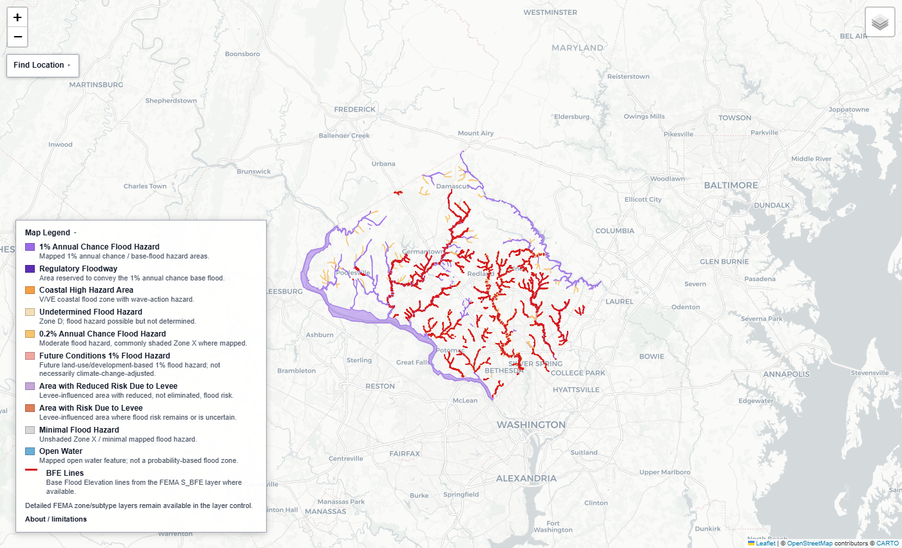

# fema-nfhl-flood-hazard-pipeline

A reproducible Python workflow for FEMA National Flood Hazard Layer (NFHL) data ingestion, validation, transformation, mapping, and flood hazard exposure summaries.

This project converts exploratory FEMA NFHL notebooks into a reusable portfolio-quality geospatial pipeline. It is designed for climate-risk, hydrology, flood-risk, and geospatial model validation workflows where defensible data handling, CRS checks, and transparent assumptions matter as much as the final map.

## Preview



## Why This Matters

Flood-risk workflows often start with public hazard data and quickly become hard to audit: files are downloaded manually, paths are local, CRS transformations are implicit, and outputs are hard to reproduce. This project demonstrates how to move from exploratory analysis to a validation-oriented workflow that can be reviewed, repeated, and extended.

## What The Workflow Does

- Downloads FEMA NFHL zip files by state or for all discovered files.
- Resolves county names to the five-digit Census county GEOID commonly used in county/community NFHL package prefixes.
- Safely extracts NFHL zip archives.
- Catalogs common NFHL layers such as `S_FLD_HAZ_AR`, `S_BFE`, `S_XS`, `S_WTR_LN`, `S_LOMR`, and `L_COMMUNITY_INFO`.
- Clips larger NFHL extracts to a county boundary or study-area bounding box for manageable case-study analysis.
- Validates CRS, geometry, flood-zone attributes, BFE values, and key NFHL fields.
- Converts selected NFHL layers to GeoParquet or GeoPackage.
- Creates a Folium flood hazard map using an EPSG:4326 copy of the vector data, with a compact FEMA-informed grouped legend, detailed `FLD_ZONE` / `ZONE_SUBTY` layers, cleaned tooltips, an explicit limitations note, expandable raw FEMA attributes, and a point lookup control for coordinates or optional address geocoding.
- Exports a high-resolution PNG or JPEG rendering of the interactive map for README previews, slides, and portfolio screenshots when a headless browser is available.
- Produces floodplain area summaries by administrative unit and flood zone using an equal-area CRS.
- Creates a static portfolio chart from the exposure summary.

## What It Does Not Do

This is not an official FEMA flood determination product. It does not replace FEMA Map Service Center products, engineering studies, insurance determinations, permitting review, hydraulic modeling, or local floodplain management decisions.

This project intentionally does **not** calculate flood depth. A previous prototype depth workflow was removed because BFE-to-DEM depth surfaces require stronger hydraulic, vertical datum, connectivity, and interpolation assumptions than this portfolio project should claim.

This repository is intended for reproducible data handling, validation, visualization, and mapped flood-hazard exposure summaries. It should be treated as a screening and portfolio workflow, not a substitute for official FEMA products or engineering judgment.

## Data Sources

This workflow is designed around publicly available FEMA National Flood Hazard Layer data and related NFHL/FIRM database layers. Users are responsible for verifying the effective date, coverage, and completeness of the FEMA package used for any study area.

## Installation

```bash
git clone <your-repo-url>
cd fema-nfhl-flood-hazard-pipeline
python -m venv .venv
.venv\Scripts\activate  # Windows
pip install -e ".[dev,cli]"
```

On macOS/Linux, activate with:

```bash
source .venv/bin/activate
```

Static map image export uses a headless browser. For best results, install the export extra; it uses Playwright to wait for Leaflet basemap tiles before capture and can launch a local Chrome, Edge, or Chromium browser. For a Playwright-managed browser, install Chromium after the extra:

```bash
pip install -e ".[dev,cli,export]"
python -m playwright install chromium
```

## Development Checks

```bash
pytest
ruff check .
```

## Quick County Map Workflow

For most users, the easiest path is the county helper script. It downloads the state NFHL packages, resolves the county code, finds the county/community zip, extracts it, catalogs layers, validates layers, creates an interactive HTML map, and attempts a static PNG export beside the HTML.

For a reusable county map run on Windows PowerShell:

```powershell
powershell -ExecutionPolicy Bypass -File scripts/run_county_nfhl_map.ps1 -State MARYLAND -County "Montgomery" -Slug montgomery_md
```

Or use the Bash helper from Git Bash, WSL, macOS, or Linux:

```bash
bash scripts/run_county_nfhl_map.sh --state MARYLAND --county Montgomery --slug montgomery_md
```

To run another county, update these three values:

- `State` / `--state`: full state name used by FEMA downloads, for example `MARYLAND`, `CALIFORNIA`, or `TEXAS`.
- `County` / `--county`: county or county-equivalent name, with or without the suffix, for example `"Montgomery"` or `"Montgomery County"`.
- `Slug` / `--slug`: short output filename prefix, for example `montgomery_md`, `alameda_ca`, or `harris_tx`.

`Slug` does not control which FEMA data is selected. It only controls output names. For example, `-Slug montgomery_md` writes:

```text
outputs/montgomery_md_download_catalog.csv
outputs/montgomery_md_nfhl_catalog.csv
outputs/montgomery_md_validation_report.csv
outputs/montgomery_md_flood_hazard_map.html
outputs/montgomery_md_flood_hazard_map.png
```

The helper resolves Montgomery County to the five-digit Census county GEOID `24031`, then looks for a FEMA package such as `24031C_*.zip`.

Additional examples:

```powershell
powershell -ExecutionPolicy Bypass -File scripts/run_county_nfhl_map.ps1 -State CALIFORNIA -County "Alameda" -Slug alameda_ca
powershell -ExecutionPolicy Bypass -File scripts/run_county_nfhl_map.ps1 -State TEXAS -County "Harris" -Slug harris_tx
```

```bash
bash scripts/run_county_nfhl_map.sh --state CALIFORNIA --county Alameda --slug alameda_ca
bash scripts/run_county_nfhl_map.sh --state TEXAS --county Harris --slug harris_tx
```

To look up a county code directly:

```bash
python -m fema_nfhl.cli county-code --state MARYLAND --county Montgomery
python -m fema_nfhl.cli county-code --state MD --county Montgomery --value-only
python -m fema_nfhl.cli county-code --county Montgomery
```

The lookup table is bundled from the U.S. Census Bureau 2025 County Adjacency File. In FEMA NFHL zip names, the relevant county prefix is typically the five-digit county GEOID, for example `24031` in `24031C_*.zip`.

If you already know the five-digit county code, you can still use it directly:

```powershell
powershell -ExecutionPolicy Bypass -File scripts/run_county_nfhl_map.ps1 -State MARYLAND -CountyFips 24031 -Slug montgomery_md
```

```bash
bash scripts/run_county_nfhl_map.sh --state MARYLAND --county-fips 24031 --slug montgomery_md
```

The basic county map workflow does not require a separate county boundary shapefile. It maps the extracted FEMA NFHL package for the selected county/community. Boundary clipping and exposure summaries are available as separate commands when you want a smaller study area or admin-unit area calculations.

The static image export is best effort in the helper scripts. If no compatible browser is available, the script warns and keeps the HTML output. To skip image export:

```powershell
powershell -ExecutionPolicy Bypass -File scripts/run_county_nfhl_map.ps1 -State MARYLAND -County "Montgomery" -Slug montgomery_md -SkipImage
```

```bash
bash scripts/run_county_nfhl_map.sh --state MARYLAND --county Montgomery --slug montgomery_md --skip-image
```

To export JPEG instead of PNG:

```powershell
powershell -ExecutionPolicy Bypass -File scripts/run_county_nfhl_map.ps1 -State MARYLAND -County "Montgomery" -Slug montgomery_md -ImageFormat jpg
```

```bash
bash scripts/run_county_nfhl_map.sh --state MARYLAND --county Montgomery --slug montgomery_md --image-format jpg
```

## Other CLI Commands

For a quick county-level visual check after downloading Alameda County (`06001`) NFHL, run:

```bash
python -m fema_nfhl.cli quickstart --zip data/raw/CALIFORNIA/06001C_20260428.zip
```

That single command extracts the zip, catalogs layers, writes a validation report, and creates `outputs/flood_hazard_map.html`. Use the more granular commands below when you want to inspect or customize each step.

```bash
python -m fema_nfhl.cli --help
python -m fema_nfhl.cli download --state CALIFORNIA --output data/raw --skip-existing --catalog-csv outputs/nfhl_download_catalog.csv
python -m fema_nfhl.cli extract --zip data/raw/CALIFORNIA/example.zip --output data/extracted
python -m fema_nfhl.cli catalog --input data/extracted --output outputs/nfhl_catalog.csv
python -m fema_nfhl.cli clip --input data/extracted --boundary data/boundaries/alameda_county.shp --boundary-id-field GEOID --boundary-id-value 06001 --output data/case_study/alameda
python -m fema_nfhl.cli validate --input data/case_study/alameda --output outputs/validation_report.csv
python -m fema_nfhl.cli transform --input data/case_study/alameda --output data/processed --format geoparquet
python -m fema_nfhl.cli map --input data/case_study/alameda --output outputs/flood_hazard_map.html
python -m fema_nfhl.cli export-map-image --html outputs/flood_hazard_map.html --image-output outputs/flood_hazard_map.png --image-width 2200 --image-height 1400 --image-scale 2
python -m fema_nfhl.cli exposure --flood-layer data/case_study/alameda/S_FLD_HAZ_AR.shp --admin-boundaries data/boundaries/alameda_county.shp --output outputs/floodplain_area_summary.csv
python -m fema_nfhl.cli plot-exposure --summary-csv outputs/floodplain_area_summary.csv --output outputs/floodplain_area_summary.png --title "Alameda County Floodplain Area By FEMA Zone"
```

The intended portfolio case study is county-scale Alameda County, California. The downloader remains state-capable because FEMA distribution can be state- or community-oriented, but the analysis workflow should clip to a county, municipality, HUC, or small bounding box before mapping or vector overlay.

## Expected Outputs

- `outputs/<slug>_download_catalog.csv`: download status, URLs, local paths, file sizes, and errors.
- `data/extracted/<fema_zip_name>/`: safely extracted NFHL package selected by state and county.
- `outputs/<slug>_nfhl_catalog.csv`: discovered NFHL layers, CRS, bounds, fields, and key attribute flags.
- `outputs/<slug>_validation_report.csv`: validation findings and warnings.
- `outputs/<slug>_flood_hazard_map.html`: interactive FEMA flood hazard map with grouped legend layers, detailed zone/subtype overlays, cleaned feature tooltips, a clear non-official FEMA determination caveat, expandable raw FEMA attributes, and coordinate/address point lookup.
- `outputs/<slug>_flood_hazard_map.png` or `.jpg`: static browser-rendered map image for presentation use. This is a screenshot-style export, not a geospatial raster.
- `outputs/floodplain_area_summary.csv`: floodplain area by admin unit and FEMA zone.
- `outputs/floodplain_area_summary.png`: static portfolio chart from the exposure summary.

Small example CSVs and a sample chart are included under `outputs/sample/`. Large FEMA zips, shapefiles, rasters, GeoPackages, and GeoParquet outputs are intentionally ignored by git.

## Methodology Summary

The pipeline treats `S_FLD_HAZ_AR` as the authoritative mapped flood hazard polygon layer for mapping and floodplain area summaries. `S_BFE` provides base flood elevation line information where available and is shown on maps as a contextual NFHL layer, not used for derived depth modeling.

The interactive map uses a two-tier information design: the collapsible legend groups FEMA flood hazard categories in plain English, while feature tooltips show cleaned, human-readable values. Nulls, blanks, and FEMA placeholder values such as `-9999` are hidden from default tooltips. Raw FEMA fields remain available in expandable raw attributes for auditability. The map also includes a visible caveat that it is not an official FEMA flood determination and that BFE units/datum must be verified before analysis.

The map includes a "Find Location" control. Coordinate lookup is evaluated locally in the browser using WGS84 longitude/latitude. Address lookup is optional and requires an explicit checkbox because it sends the typed address, and possible normalized variants, to external geocoding services: OpenStreetMap Nominatim and, if needed, Esri ArcGIS World Geocoder. The lookup tries street-address matches first; city/ZIP fallbacks are marked approximate. If a point is outside the loaded NFHL data extent, the map reports that the relevant county/state package should be generated before interpreting the result. For property-level checks, pasted longitude/latitude coordinates are usually more reliable than public address geocoding.

Vector layers are reprojected to EPSG:4326 only for Folium web mapping. Area summaries are calculated after reprojection to an equal-area CRS, defaulting to EPSG:5070 for CONUS workflows.

## Scientific Limitations

- FEMA NFHL coverage and attribute completeness vary by community and county.
- BFE lines may be sparse or missing.
- FEMA flood polygons are regulatory/hazard mapping products, not event simulations.
- Exposure summaries calculate mapped flood hazard area, not dynamic inundation, damage, or asset-level loss.
- This tool does not calculate flood depths, perform hydraulic routing, correct vertical datums, or simulate flood events.

## Portfolio Positioning

This repository is intended to demonstrate reproducible geospatial engineering, climate-risk data validation, scientific caution, and clean Python packaging. It is framed as a transparent FEMA NFHL hazard/exposure workflow, not an operational flood model or official determination tool.

## License

Code license: MIT License.

Data: FEMA/NFHL source data are not redistributed in this repository.
